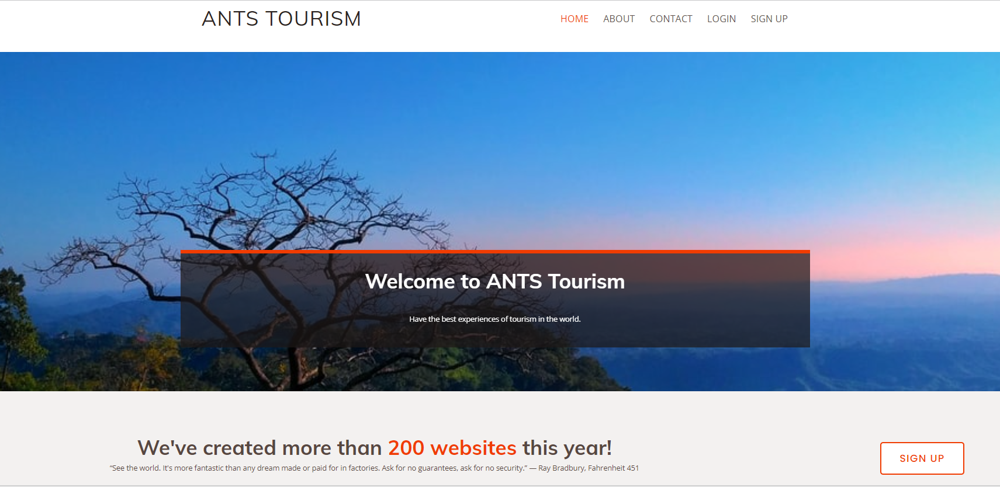
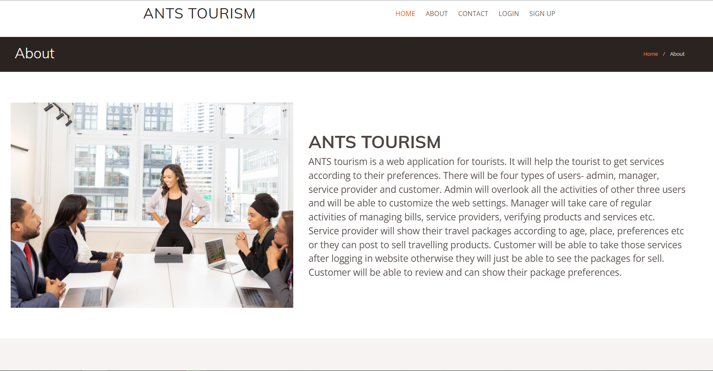
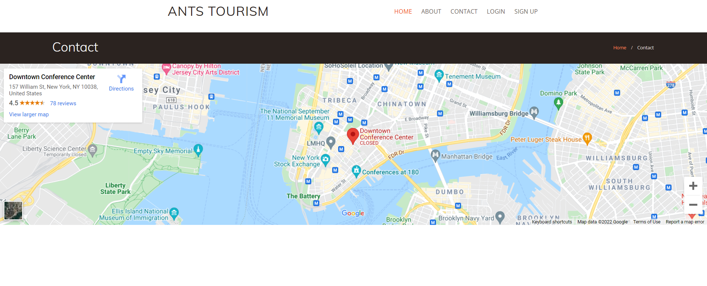
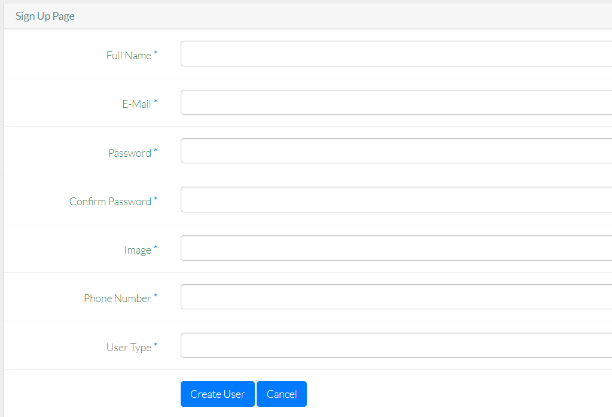

# ANTSTourism
 Backend-ASP.net, Frontend-AngularJS
 
# Run the codes
------> Download the zip file 
------> Extract the file 
------> Import the database into your Microsoft SQL Server Management Studio 
------> Run the backend code from visual studio 
------> Run the frontend code in live server(I have used visual studio code) 
------> Now see the project in your browser 

# What is ANTS tourism?

ANTS tourism is a web application for tourists. It will help the tourist to get services according to their preferences and also it will help the tourist/customer to get travel related products. There will be four types of users- admin, manager, service provider and customer. Admin will overlook all the activities of other three users and will be able to customize the web settings. Manager will take care of regular activities of managing bills, service providers, verifying products and services etc. Service provider will show their travel packages according to age, place, preferences etc or they can post to sell travelling products. Customer will be able to take those services after logging in the website otherwise they will just be able to see the packages and products for sell. Customer will be able to review and can show their package preferences.

## Users:
<ul>
 <li>	Admin</li>
 <li>	Manager</li>
 <li>	Service Providers</li>
 <li>	Customer</li>
 </ul>

##  Common Features
 <ul>
 <li>1.	Login</li>
 <li>2.	Home (Package Showing)</li>
 <li>3.	Registration</li>
<li>4.	Blog</li>
 </ul>

## Admin
 <ul>
 <li>	Add Manager</li>
 <li>	Edit, Delete Manager, Buyer, Seller</li>
 <li>	See complains</li>
 <li>	Upload notices</li>
 <li>	Takes action according to complains</li>
 <li>	SEO management</li>
 <li>	Theme Customization</li>
 <li>	Dashboard for monthly income</li>
</ul>

## Manager
<ul>
 <li>	Verify Service Provider</li>
 <li>	Manages service providers</li>
 <li>	Manage payments of service provider</li>
 <li>	Manage advertisements/promotion</li>
 <li>	Manages featured product or new discounted offers</li>
 <li>	Blog management</li>
 <li>	Checking reliability of service providers</li>
 <li>	Approving packages</li>
 </ul>
 
## Service Providers
<ul>
 <li>	Sign up</li>
 <li>	Upload packages</li>
 <li>	Provide discount to packages</li>
 <li>	Provide discount to customers</li>
 <li>	Can add/publish new services</li>
 <li>	Can edit service information</li>
 <li>	Will have an analytical dashboard to view stats</li>
 <li>	Can delete a service</li>
 <li> Can create card</li>
 <li> Manages payment details</li>
 <li> Shows related packages</li>
 <li>	Add packages according to customer demand</li>
 <li>	SEO management</li>
 <li>	Dashboard for sold packages</li>
 </ul>
 
## Customer
<ul>
 <li>	Sign up</li>
 <li>	Can View and search Packages</li>
 <li>	Can view package details</li>
 <li>	Can Buy packages</li>
 <li>	Can Cancel package order</li>
 <li>	Can view and search order history</li>
 <li>	Can view order details</li>
 <li>	Can view and edit profile</li>
 <li>	 Can give feedback</li>
 <li>	Can complain</li>
 <li>	Can write Blog</li>
 <li>	Can view notices</li>
 <li>	Can view transactions and transaction details</li>
</ul>

# Frontend

## Home

## Admin

## Customer

